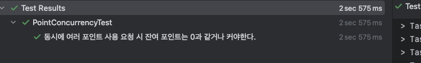
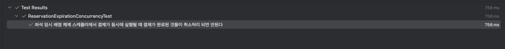

# 📖 동시성 이슈/설계

## 1️⃣ 좌석 예약 시 중복 예약 발생 가능

### 문제 상황 및 내부 구조

- 동시에 여러명이 좌석 예약 요청 시 중복 예약이 생길 수 있다.
- 유저 식별자와 좌석 식별자로 예약 데이터(임시배정 상태)를 INSERT 하고 있다.
- 예약 데이터 INSERT 전에 좌석 식별자로 예약 데이터 Double Check 하고 있다.

### 해결 전략

- 데이터 정합성이 중요하고 인기 좌석일 경우 충돌이 많아질 수 있어 비관적 락으로 설정
  - **DB Lock : 비관적 락**
- 트랜잭션 격리 수준은 처음 한번 조회하여 중복 체크만 하므로 READ COMMITTED 로 설정
  - **트랜잭션 격리 수준 : READ COMMITED**
- 데드락 방지
  - **트랜잭션 타임아웃 10초 설정**

### 테스트 결과
- 상세 테스트 코드
  - [ReservationConcurrencyTest.java](../src/test/java/kr/hhplus/be/server/integration/concurrency/ReservationConcurrencyTest.java)
    - 동시에 여러명이 하나의 좌석 예약 요청 시 한 명만 성공한다
    - 동시에 여러명이 여러개의 좌석에 각각 예약 요청 시 한 명씩만 성공한다
- 결과
  

---

## 2️⃣ 포인트 잔액 차감 시 음수 잔액 발생 가능
### 문제 상황 및 내부 구조

- 동시 여러 포인트 사용 요청 시 잔액 조회 -> 계산 -> 갱신 과정 중 포인트 잔액이 음수가 발생할 수 있다.
- 유저 정보에서 포인트 조회 후 잔여 포인트 - 사용 포인트 계산 후 잔액을 UPDATE 한다.
- 유저 도메인에서 잔여 포인트가 사용 포인트보다 작으면 예외가 발생하도록 로직이 포함되어 있다.

### 해결 전략

- 포인트 사용요청은 충돌이 많지 않아 낙관적 락으로 설정
  - **DB Lock : 낙관적 락**
- 트랜잭션 격리 수준은 처음 한번 조회만 하므로 Dirty Read 만 방지, READ COMMITTED 로 설정
  - **트랜잭션 격리 수준 : READ COMMITED**
- 데드락 방지
  - **낙관적 락 사용으로 데이터의 잠금이 최소화 되어 타임아웃 생략**

### 테스트 결과
- 상세 테스트 코드
  - [PointConcurrencyTest.java](../src/test/java/kr/hhplus/be/server/integration/concurrency/PointConcurrencyTest.java)
    - 동시에 여러 포인트 사용 요청 시 잔여 포인트는 0과 같거나 커야한다.
- 결과
  
---

## 3️⃣ 좌석 임시 배정 해제 스케줄러 실행 시 데이터 정합성 문제
### 문제 상황 및 내부 구조

- 좌석 임시 배정 해제 스케줄러에서 임시배정 상태를 해제하는 과정에서 결제와 동시 실행 시 결제 완료된 건들도 스케줄러에서 취소 처리 시킬 가능성이 존재한다.
- 임시배정 해제 스케줄러는 예약 상태가 HOLD(임시배정) 인 예약 건들을 조회 후 Redis 에서 TTL(5분)로 만료된 건들을 취소 상태로 UPDATE
- 결제 진행 시 예약 상태가 HOLD(임시배정) 이고 Redis 에 존재하는지 체크하고 포인트 차감 후 COMPLETED(완료) 상태로 UPDATE

### 해결 전략

- 하나의 예약 건에 대하여 임시배정 해제 스케줄러와 결제 진행이 충돌될 경우가 낮아 조건부 UPDATE 로 동시성 제어
  - **조건부 UPDATE**
- 트랜잭션 격리 수준은 임시배정인 건들을 처음 한번 조회만 하므로 Dirty Read 만 방지, READ COMMITTED 로 설정
  - **트랜잭션 격리 수준 : READ COMMITED**
- 데드락 방지
  - **조건부 UPDATE 사용으로 데이터의 잠금이 최소화 되어 타임아웃 생략**

### 테스트 결과
- 상세 테스트 코드
  - [ReservationExpirationConcurrencyTest](../src/test/java/kr/hhplus/be/server/integration/concurrency/ReservationExpirationConcurrencyTest.java)
    - 동시에 여러 포인트 사용 요청 시 잔여 포인트는 0과 같거나 커야한다.

- 결과
  