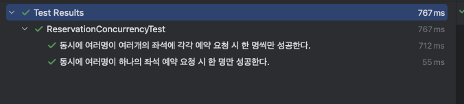

# 📖 동시성 이슈/설계

## 1️⃣ 좌석 예약 시 동시성 이슈

### 문제 상황 및 내부 구조

- 동시에 여러명이 좌석 예약 요청 시 중복 예약이 생길 수 있다.
- 유저 식별자와 좌석 식별자로 예약 데이터(임시배정 상태)를 INSERT 하고 있다.
- 예약 데이터 INSERT 전에 좌석 식별자로 예약 데이터 Double Check 하고 있다.

### 해결 전략

- 데이터 정합성이 중요하고 인기 좌석일 경우 충돌이 많아질 수 있어 비관적 락으로 설정
  - **DB Lock : 비관적 락**
- 트랜잭션 격리 수준은 처음 한번 조회하여 중복 체크만 하므로 READ COMMITTED 로 설정
  - **트랜잭션 격리 수준 : READ COMMITED**
- 데드락 방지
  - **트랜잭션 타임아웃 10초 설정**

### 테스트 결과
- 상세 테스트 코드
  - [ReservationConcurrencyTest.java](../src/test/java/kr/hhplus/be/server/integration/concurrency/ReservationConcurrencyTest.java)
    - 동시에 여러명이 하나의 좌석 예약 요청 시 한 명만 성공한다
    - 동시에 여러명이 여러개의 좌석에 각각 예약 요청 시 한 명씩만 성공한다
- 결과
  
