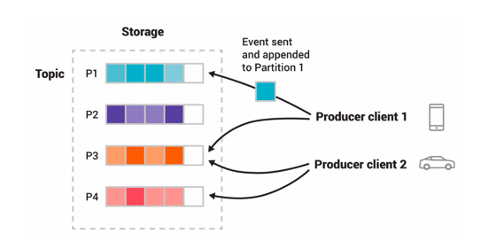
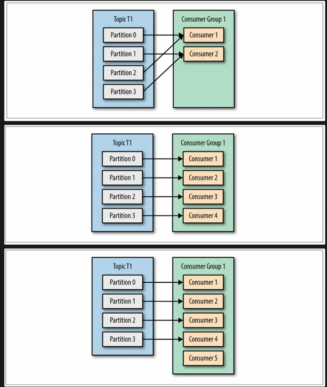

# Kafka 란?
## 정의
- 분산 이벤트 스트리밍 플랫폼이며 주로 서비스 간 비동기 통신이나 데이터 파이프 라인 구축을 위해 사용
- **이벤트**가 발생할 때 마다 저장하고, 이를 구독 중인 서비스에 실시간으로 전달

## 구성요소
- Producer
  - 이벤트가 발생 시 이벤트를 브로커에 발행하는 서비스
- Consumer
  - 특정 이벤트를 구독하고 있는 서비스로 이벤트를 읽고 처리하는 서비스
- Broker
  - Kafka 클러스터를 구성하는 물리적인 서버
  - Producer 에서 발행된 이벤트를 offset 지정하고 디스크에 저장
  - offset (위치) 는 Consumer 가 이벤트를 어디까지 읽었는지에 대한 정보
  - Broker 중 하나는 **Controller** 역할을 맡아 클러스터의 메타 데이터 관리, 파티션 리더 선출, Broker 등록/제거 감지를 담당
  - Broker 중 특정 하나는 **Coordinator** 역할을 맡아 하나 또는 여러 Consumer Group 의 Rebalancing, offset 지정을 관리
  - 모든 Broker 는 클러스터의 메타 데이터를 각각 들고 있으며 클라이언트가 처음 연결할 때 사용하는 브로커 후보들을 **Bootstrap Servers** 로 정의
    <pre> bootstrap.servers = broker1:9092,broker2:9092,broker3:9092 </pre>
- Event (Message)
  - 서비스에서 발생된 이벤트를 기록한 것 레코드 또는 메시지 라고도 함
  - Producer 에서 Consumer 로 이동 되는 데이터
  - <Key, Value> 형식으로 구성되고 Key 는 보통 리소스 ID, Value 는 리소스의 상세 정보
- Topic & Partition
  - Topic 은 Event 를 분류하는 기준이며 해당 Topic 을 구독중인 Consumer 에게 데이터를 전달
  - Topic 은 N 개의 Partition 을 가지며 이벤트를 병렬 처리하여 빠른 처리가 가능
  - 하나의 Partition 은 하나의 Consumer 에게 이벤트를 순차적으로 전달
  - Event 의 Key 의 해시 값으로 Partition 을 지정하기 때문에 같은 Key 는 같은 Partition 에 항상 지정 (순차 처리)
  - Event 의 Key 가 없을 경우는 Round-Robin 방식으로 Partition 을 지정

- Consumer Group
  - Topic 을 구독하는 하나의 단위이며 보통 하나의 서비스
  - Consumer Group 내의 Consumer(인스턴스)들이 Event를 병렬 처리하며 수평 확장 가능
  - 하나의 Partition 은 하나의 Consumer 로만 Event를 전달하며 Consumer 는 여러 Partition 에서 Event 읽기가 가능

- Rebalancing
  - Consumer Group 내의 Partition 를 재분배 하는 행위
  - Coordinator 역할을 맡은 Broker 가 처리
  - Rebalancing 중에는 Consumer 가 데이터를 읽지 못함
  - Rebalancing Case
    1. Consumer Group 내 Consumer 추가/삭제
    2. Consumer Group 내 Consumer 장애
    3. Topic 내 Partition 추가

- Cluster
  - 여러 Broker 들을 묶어 하나의 Kafka 시스템으로 구성
  - 운영 도중 브로커 증설이 가능하여 유연한 스케일링 가능

- Replication
  - Partition 복제를 하여 Broker 장애 시에도 가용성을 유지할 수 있게 함
  - Leader Partition 은 실제 Event 를 전달하고 읽기/쓰기를 담당하는 주체
  - Follower Partition 은 Leader Partition 데이터를 비동기적으로 복제하며 대기 상태
  - 각 Leader, Follower Partition 들은 서로 다른 Broker 에 위치
  - Leader 가 장애 시 Follower Partition 들 중 동기화가 잘되고 있는 것 중 하나가 승격 (ISR)

    | 설정                  | 설명                                           | 예시       |
    |-----------------------|------------------------------------------------|------------|
    | `replication.factor`  | 복제본 개수 (리더 + 팔로워 수)                | `3`        |
    | `min.insync.replicas` | 메시지를 쓸 수 있는 최소 동기화 복제 수       | `2`        |
    | `acks`                | 프로듀서의 메시지 전송 성공 조건              | `0`, `1`, `all` |

## 장/단점
| 구분   | 내용 |
|--------|------|
| ✅ 장점 | 고성능, 확장성, 재처리 가능, 내구성, 느슨한 결합, 다중 소비자 |
| ❌ 단점 | 설정/운영 복잡, 학습 곡선, 순서 제약, 리밸런싱 일시중단, 저장 비용 |