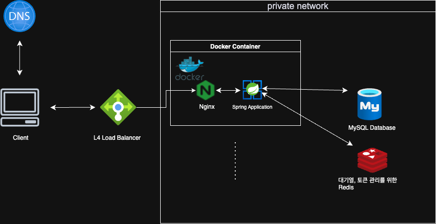

| 구성요소 | 역할 및 설명 |
| --- | --- |
| DNS (Domain Name System) | 도메인 → L4 IP 매핑 (예: `ticket.example.com`) |
| L4 Load Balancer | TCP/UDP 레벨 로드 밸런싱 (IP:Port 기준), 클라이언트 요청을 Nginx로 전달 |
| Nginx | L7 Proxy, SSL 종료 처리, 정적 파일 처리, 리버스 프록시 역할 |
| Spring Application (WAS) | 비즈니스 로직 처리 (유저 관리, 대기열, 좌석 예약, 결제 처리) |
| MySQL Database | 사용자 정보, 좌석, 예약, 결제 데이터 저장 |
| Redis | 대기열 관리 (토큰 발급, 순번 관리), TTL 처리 |
| Docker (컨테이너 런타임) | Nginx, Spring Application 등을 컨테이너로 배포 |
| Private Network | 내부 서비스(Nginx, App, DB, Redis) 간 네트워크 |