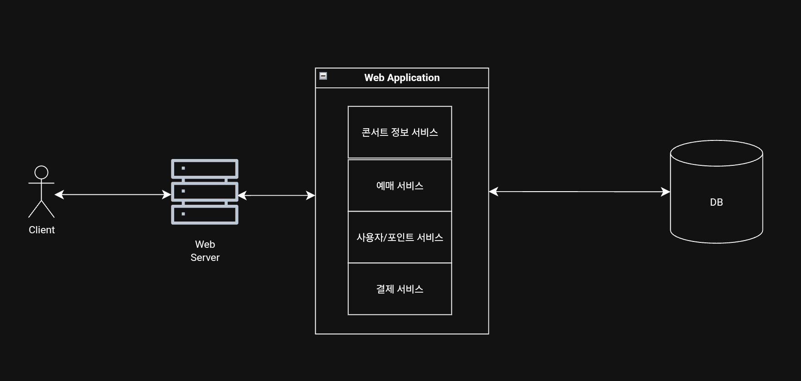
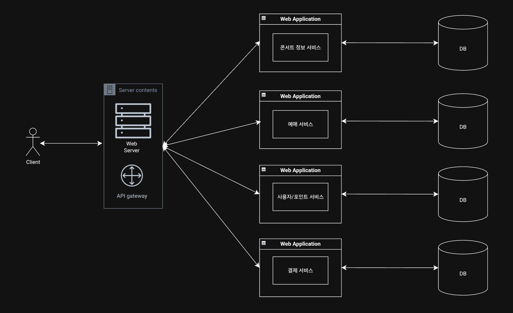
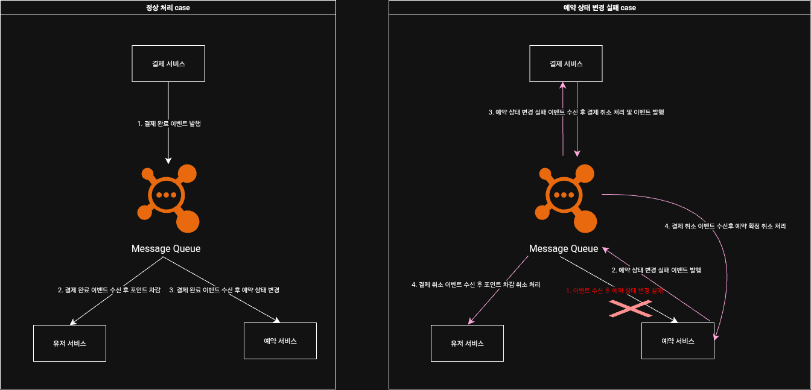

# 🎯 MSA 전환 설계

## 1. 도메인 분리 구조

### ✅ 기존 구조 (Monolith)

- 하나의 애플리케이션 내에 모든 도메인 서비스가 존재
- 단일 트랜잭션 처리로 트랜잭션 처리가 용이
- 구조가 단순하여 개발 초기 빠른 속도
- 하나의 기능 수정에도 배포 단위가 커 빌드/배포 속도가 느림
- 다른 기술 혼용이 어렵다



---

### ✅ MSA 적용 구조

- `concert`, `Reservation`, `User`, `Payment` 도메인 서비스로 분리
- 각 서비스는 독립성을 가지며 각자 빌드/배포하여 속도가 빠름
- 특정 서비스 장애 시 전체적인 영향이 적음
- 각 서비스는 각자의 DB를 가지므로 트랜잭션 처리가 복잡



---

## 2. 트랜잭션 문제

### ✅ 기존 처리 흐름 (단일 트랜잭션)

```text
[트랜잭션 시작]
   ↓
[포인트 차감 UPDATE]
   ↓
[결제 정보 INSERT]
   ↓
[예약 상태 UPDATE]
   ↓
[트랜잭션 종료]
```

- 장점: **원자성 보장**, 모든 작업이 하나의 트랜잭션으로 관리됨  
- 단점: **MSA 환경에서는 불가능**, DB가 분리되어 있기 때문

---

## 3. 트랜잭션 분산 환경에서의 해결 방법

### 🚫 방법 1: 각 서비스 API 동기 호출
- 기능 수행 시 필요 서비스의 API 호출하여 동기적으로 실행하는 방식

- 장점
  - 하나의 서비스에서 기능을 전체적으로 볼 수 있어 직관적이다.
  - 빠른 구현과 테스트가 용이

- 단점
  - 호출하는 서비스의 트랜잭션 실패 시 이미 호출한 서비스를 롤백할 수 없어 원자성이 깨짐
  - API 지연 시 락 유지 시간이 길어져 성능이 저하되고 데드락 위험이 있음
  - 서비스 간 강한 결합으로 호출하는 서비스는 대상 서비스의 API 스펙을 모두 알고 있어야 함

---

### ✅ 방법 2: 이벤트 기반 비동기 처리 (추천)
- 기능 수행 시 필요 서비스에 이벤트를 통하여 비동기적으로 전달하는 방식

- 장점
  - 서비스 간 느슨한 결합으로 발신 서비스는 수신 서비스를 몰라도 됨
  - 비동기 처리로 성능이 향상
  - 수신 서비스가 늘어나도 발신 서비스의 수정이 없어 확장성이 높음

- 단점
  - 흐름 추적이 어려워 한눈에 파악하기 힘듦 (문서화 필요)
  - 수신 서비스의 트랜잭션 실패 시 롤백하는 로직 필요 (보상 트랜잭션)
---

## 4. Saga 패턴 적용

### ✅ Choreography 기반 Saga

- 서비스 간에 **도메인 이벤트를 발행**하고, 이를 **다른 서비스가 수신**하여 자체 로직을 처리
- 실패 시 **보상 이벤트 발행 → 보상 트랜잭션 실행**

```text
결제 성공 이벤트
   ↓
포인트 서비스: 포인트 차감 
예약 서비스: 예약 상태 확정
```

- 실패 시:
    - 포인트 차감 실패 → **결제 취소 이벤트**
    - 예약 확정 실패 → **결제 취소 이벤트**

---

### 💡 Orchestrator 기반과 비교

| 항목 | Choreography | Orchestrator |
|------|--------------|--------------|
| 방식 | 각 서비스가 이벤트를 직접 발행/구독 | 중앙 Orchestrator가 제어 |
| 장점 | 단순하고 느슨한 결합 | 흐름 제어 용이, 복잡한 로직 가능 |
| 단점 | 흐름 복잡, 추적 어려움 | 중앙 집중화로 단일 실패점 가능 |

---

## 5. 적용 Flow 예시


